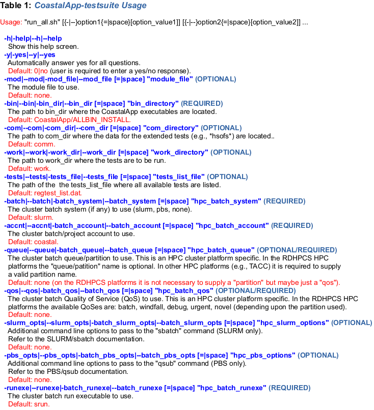

### Contacts:

 * [Panagiotis.Velissariou@noaa.gov](mailto:Panagiotis.Velissariou@noaa.gov)
 * [Saeed.Moghimi@noaa.gov](mailto:Saeed.Moghimi@noaa.gov)

## Introduction

***CoastalApp-testsuite*** contains comprehensive tests for the different modeling
components implemented in [CoastalApp](https://github.com/noaa-ocs-modeling/CoastalApp). The test suite is used to run automated tests for the model and data components after an update in *CoastalApp*. There are two set of tests: (a) small scale tests that require very limited compute resources (e.g., the Shinnecock inlet cases) and (b) large scale tests that require extensive compute resources that can be run on a Cluster/HPC environment (e.g., the HSOFS cases). In any case, to run any of these tests the user is responsible to download and compile *CoastalApp* first.

***Component name abbreviations used in the testsuite:***

<pre>
   <B>atm</B>         ATMESH data component
   <B>pam</B>         PAHM model component
   <B>adc</B>         ADCIRC model component
   <B>sch</B>         SCHISM model component
   <B>fvc</B>         FVCOM model component
   <B>ww3</B>         WaveWatch III model component
   <B>ww3data</B>     WW3DATA data component
</pre>

## Downloading the *CoastalApp-testsuite*

*CoastalApp-testsuite* is hosted in NOAA's Office of Coast Survey github modeling repository: [https://github.com/noaa-ocs-modeling](https://github.com/noaa-ocs-modeling) along with other applications and models. The source code of *CoastalApp* is publicly available from the GitHub repository:
  <a href="https://github.com/noaa-ocs-modeling/CoastalApp-testsuite"
     TARGET="_BLANK" REL="NOREFERRER">https://github.com/noaa-ocs-modeling/CoastalApp-testsuite</a>.

This application can be downloaded using one of the following methods:

***(1) Clone CoastalApp-testsuite from GitHub using the command:***

        git clone https://github.com/noaa-ocs-modeling/CoastalApp-testsuite.git

The source will be downloaded into the target directory CoastalApp-testsuite.

***(2) Download the CoastalApp-testsuite archive using the command:***

        wget https://github.com/noaa-ocs-modeling/CoastalApp-testsuite/archive/refs/heads/main.zip

and extract the sources in the CoastalApp-testsuite directory by issuing the following commands:

        unzip -o main.zip  (the data will be extracted into the CoastalApp-testsuite-main directory)

        mv CoastalApp-testsuite-main CoastalApp-testsuite  (move the extracted files to the CoastalApp-testsuite directory)

**NOTE:** *It is assumed that all subsequent operations take place inside the CoastalApp-testsuite directory* (``cd CoastalApp-testsuite``).

## Downloading and Compiling *CoastalApp*

If the application is not already downloaded and/or compiled, you may refer to *CoastalApp's* [README.md](https://github.com/noaa-ocs-modeling/CoastalApp#readme) file for detailed instructions on how to download and compile *CoastalApp*.
While, the location of the *CoastalApp* is a user's preference, it is suggested to
download the application into the CoastalApp-testsuite directory where the top level
"run" script can find CoastalApp.

## Downloading Required Data (Optional)

To run the large scale tests (e.g., "hsofs" cases) or model cases that require large input data (e.g., FVCOM cases) download the required data to run the tests (all shinnecock test cases are self contained) using the commands:

        cd CoastalApp-testsuite
        wget https://tacc-nos-coastalapp-testsuit.s3.amazonaws.com/hsofs-data-v3.tgz

and extract the data into the "comm" directory by issuing the command: 

        tar -zxvf hsofs-data-v3.tgz
 
 This command will extract the data into the CoastalApp-testsuite/comm directory.

## How to run the CoastalApp-testsuite test cases

The run infrastracture in CoastalApp-testsuite utilizes environment module systems
like [Lmod](https://lmod.readthedocs.io/en/latest/) (installed in most HPC clusters) or 
[Environment Modules](https://modules.readthedocs.io/en/latest/). The library requirements to run the test cases are the same as those of *CoastalApp* (please refer to the *CoastalApp's* [README.md](https://github.com/noaa-ocs-modeling/CoastalApp#readme) file for a detailed explanation on system requirements).

### Run System

To run particular test case(s), CoastalApp-testsuite provides the ***run_all.sh*** script which, accepts many options to allow the user to customize the run environment of the testsuite. Running the script as:

        run_all.sh --help

will bring up a help screen as shown in Table 1 that explains the use of all available options to the script:

### Run Sequence

 1. Change directory into CoastalApp-testsuite
 2. Edit the file **regtest_list.dat** and uncomment the test cases you want to run
 3. Edit (or create) an "environment file" (a sample can be found in templates/env_tests) that contains values for the different options used by the run script. The location of this file by setting the environment variable **TESTS_ENV_FILE** to point to the location of the newly created file (if env_tests is in the same location as `run_all.sh` there is no need to set the TESTS_ENV_FILE variable). If most of the option values remain the same between run sequences, it is convenient to have this file in place and only supply a few options to the script **OPTIONAL STEP**
 4. Run the `run_all.sh` script to initiate the run sequence for the requested tests

Next are given some examples of how to run the `run_all.sh` script (assuming that CoastalApp has been compiled):

 * **Example 1** Running on NOAA's RDHPCS HPC systems (the default values are designed for hera):

          run_all.sh --mod CoastalApp/modulefiles/envmodules_intel.hera

    This example assumes that CostalApp is contained within CoastalApp-testsuite. In this
    case, the script will first load the modulefiles/envmodules_intel.hera file and
    then will present to the user a list of the configured parameters, waiting for a 
    yes/no answer to continue.

 * **Example 2** CoastalApp is located outside the CoastalApp-testsuite (hera):

          run_all.sh --mod PATH_TO_CoastalApp/modulefiles/envmodules_intel.hera --bin_dir PATH_TO_CoastalApp/ALLBIN_INSTALL

 * **Example 3** Running on TACC HPC systems (CoastalApp inside CoastalApp-testsuite):

          run_all.sh --mod CoastalApp/modulefiles/envmodules_intel.tacc  --accnt nosofs --queue normal --runexe ibrun

 * **Example 4** Running on TACC HPC systems (CoastalApp inside CoastalApp-testsuite):

          run_all.sh --mod CoastalApp/modulefiles/envmodules_intel.tacc  --accnt nosofs --queue normal --runexe ibrun

 * **Example 5** Using the PBS batch system (CoastalApp inside CoastalApp-testsuite):

          run_all.sh --mod CoastalApp/modulefiles/envmodules_intel.plat --batch pbs --accnt my_accnt --queue my_queue --runexe mpirun

 * **Example 6** Using the environment file only (CoastalApp inside CoastalApp-testsuite):

          TESTS_ENV_FILE=PATH_TO_ENV_FILE run_all.sh

    In this case all options to `run_all.sh` are included in the ENV_FILE. If only specific options are to be included in the command line, the script can be run as:

          TESTS_ENV_FILE=PATH_TO_ENV_FILE run_all.sh --runexe mpirun
